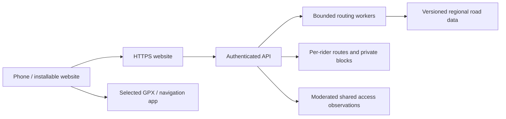

# Verge: from personal planner to a useful mobile service

Planning draft · 14 September 2026 · Public release remains **not ready**.

**Recommended direction:** make Verge an installable mobile website, test it with a small invited group of adult Android riders around Centurion, then decide whether an Android store app earns its extra cost. Establish a repeatable process for adding areas before expanding coverage. Keep turn-by-turn navigation in OsmAnd for that first pilot.

This is a proposed sequence, not permission to deploy or a promise of delivery dates. This task adds a local launcher and planning documents only. The existing private app remains the working prototype. The [release checklist](RELEASE_CHECKLIST.md) remains the record of unresolved obligations.

## 1. What the first useful product should do

A rider should be able to open Verge on their phone, choose a real start and training distance, compare a few understandable routes, and take the selected track into navigation. After encountering a closed entrance, they should be able to record the exact section and avoid it next time.

The first audience is local recreational and training cyclists who want repeatable routes, useful distance/lap choices and better access information. Proposed pilot: **15–25 invited adults, Android first, Centurion only**, with the owner coordinating feedback. Group size and platform choice are assumptions awaiting confirmation.

The product promise should be: **“Plan a ride on mapped roads, understand the route, and remember access problems.”** Describe the mapped-road score as an estimate with its evidence and gaps. Avoid marketing that implies verified safety, crime prediction, guaranteed public access or military-grade GPS accuracy.

| Rider’s need | First-release experience | How we find out whether it helps |
| --- | --- | --- |
| “Give me a ride near home.” | Confirm the actual start; choose connected local roads or a wider area | Rider can explain the start and area choice without help |
| “I need a 90 or 180 km training ride.” | Show real total, lap length, lap count and major junctions; retain score-first ranking | Geometry matches the distance tolerance and riders understand repeated laps |
| “These options look the same.” | Distinct road choices, a clear recommended choice and a fewer-lap alternative when available | Riders can state why they selected one option |
| “Don’t send me back through that gate.” | A saved private section block with a clear map preview and reopening control | The next plan and export exclude the section |
| “I want to ride, not manage files.” | Plan directly on Android and hand the prepared GPX to navigation | At least 9 of 10 observed attempts reach the intended track without coaching |
| “I want to use last week’s ride.” | Saved rides, recent starts and source/access freshness checks | Riders return to use it on another day |

Keep live tracking, in-app voice navigation, emergency response, payments, training imports, national coverage and public social feeds outside the first pilot. They remain possible later decisions, with separate evidence and cost requirements. A small reliable workflow is enough to test usefulness.

## 2. Mobile choices

| Approach | What we retain | What it gives riders | Cost or limitation | Recommendation |
| --- | --- | --- | --- | --- |
| Installable mobile website (PWA) | Existing React UI and Python routing service | A normal HTTPS link, home-screen entry, phone-sized workflow, intentionally saved route files | Requires hosted routing for use away from the computer; browser/device capabilities vary | First pilot |
| Android app using Capacitor | Much of the web UI and the same API | Store distribution and access to native integrations | App signing, plugin maintenance, device testing and store review; wrapping the UI does not put Python routing on the phone | Evaluate after pilot |
| Native navigation product | API and selected routing concepts; substantial new mobile work | Potential for owned voice guidance, background location and offline regional routing | Highest engineering, map licensing, battery-testing and operational burden | Separate later product decision |

A PWA needs an appropriate manifest and secure delivery for installation. Offline behaviour must be designed separately; installation is not proof of offline navigation. [MDN installation guide](https://developer.mozilla.org/en-US/docs/Web/Progressive_web_apps/Guides/Making_PWAs_installable).

Capacitor provides a native runtime for web applications, but its geolocation plugin does not directly provide background geolocation. An app wrapper is not a navigation engine. [Capacitor overview](https://capacitorjs.com/docs), [geolocation plugin](https://capacitorjs.com/docs/apis/geolocation). Any later Android location design must account for foreground/background permissions and platform restrictions. [Android location permissions](https://developer.android.com/develop/sensors-and-location/location/permissions).

**Proposed phone layout:** one map-led planning screen with a bottom panel; a Saved rides screen; account/settings behind a small menu. Reporting access belongs on the selected ride, not in another navigation tab. Keep the existing brand. Use large touch controls, visible loading/cancel states, readable sunlit contrast and a non-drag alternative for every map edit. Preserve the ride after refresh, rotation, an interrupted request or a failed download. Start location permission is requested only when the rider chooses it.

The mobile prototype should demonstrate: install → choose area → confirm start → compare routes → save/download → open in navigation → record a blocked entrance while stopped → replan. Sketch this flow before implementing it.

**Offline scope for the pilot:** saved route geometry, relevant notices and an already prepared GPX may be retained locally. New server calculations require connectivity. OsmAnd handles its own offline navigation/maps. Do not show a saved route as newly checked while offline; show when its access information was last checked. Do not cache authenticated API responses indiscriminately or mix riders’ files on a shared phone.

## 3. What must change before other people use it

The current app is a single-owner installation. Its global record export/deletion, personal access blocks, administrator key, in-memory request limits and temporary unencrypted Wi-Fi transfer must not become a public multi-user system merely by changing the bind address.

Proposed architecture:

Use the existing routing code as the starting point. Benchmark before choosing a different engine. For hosted private records, propose PostgreSQL with explicit ownership checks and migrations; add spatial tooling where the regional/reporting design needs it. These are design recommendations, not installed dependencies.

Before inviting riders:

- Choose the legal operator, domain owner, administrator and support contact. Separate the owner’s existing private records from the pilot database; no automatic upload or migration of their home/start history.
- Establish accounts/invitations, account recovery, administrator MFA and per-user authorisation on every route, export, report and deletion endpoint. A second rider must never be able to fetch or delete the first rider’s data by changing an ID.
- Serve the app and API over HTTPS, use secrets management, set request/CPU limits and add bounded jobs with cancellation. Recalculate source/access checks when routes are exported. Share cached road graphs, not personal route responses; partition or disable result caches when starts, blocks or rider settings differ.
- Make personal blocks private to their owner. Offer a separate, explicit choice to submit a shared observation. Do not let an unreviewed public report silently close a road for every rider.
- Add tested backup/restore and deletion behaviour, a rollback procedure, dependency updates and privacy-conscious error logging. Do not log exact routes, tokens or home coordinates by default.
- Give the operator a way to suspend a bad region or calculation feature. For a credible blocked-access complaint, investigate, temporarily restrict affected planning where justified, and record the decision. Do not promise 24-hour support unless someone is staffing it.
- Disable the local LAN-transfer listener in hosted deployments. A rider planning directly on the phone can download/share there. Any later web sharing requires deliberately scoped, revocable HTTPS access, not publication of a route by default.

Hosting a website does not require a store listing. An invited beta still processes other people’s information and still needs the legal/privacy preparation below.

## 4. Add areas through a repeatable process

Two different changes need different effort:

1. **A new named start inside downloaded Centurion coverage:** confirm a public-road anchor, its name and supported profile; test it against the existing graph. A neighbourhood label does not create a routing barrier.
2. **Coverage outside the existing rectangle:** obtain and validate a new regional road dataset, access exclusions, update process and field evidence. This requires replacing hard-coded coverage assumptions and testing route joins, not just adding an option to the dropdown.

The proposed workflow is **request → inspect sources → build a candidate package → test geometry and access → field-check → approve limited coverage → monitor/update**. A region can be withdrawn without deleting riders’ records. Do not advertise a place until that process is complete.

Start by making the existing Centurion data the first versioned region. Then evaluate one additional area where someone can regularly ride and check access. The owner’s next area is still an open decision. [Area expansion design](AREA_EXPANSION_PLAN.md).

## 5. Legal and operational protection

Treat protection as several layers: clear product claims, reliable exclusion handling, privacy/security controls, reviewed contracts/notices, incident handling and appropriate insurance. Disclaimers alone cannot remove every obligation or make inaccurate routing acceptable. Where the Consumer Protection Act applies, sections 48–51 constrain unfair terms and certain liability exclusions; section 51 addresses exclusions for supplier gross negligence. [Official Consumer Protection Act](https://www.gov.za/sites/default/files/32186_467.pdf).

Before outside testers, commission a South African legal review of the actual proposed service and operator. The [legal review brief](LEGAL_REVIEW_BRIEF.md) includes original draft notices for review, an evidence register and the questions to resolve. It covers POPIA/PAIA, service terms, location data, reporting, brand ownership, maps/software licences, future subscriptions and insurance. It is not a certification or a complete contract ready to publish.

Keep the current in-app release checklist visible. Record each item’s owner, evidence and review date before marking it complete. Proposed hosted policies must not replace the private app’s truthful current notice until the corresponding behaviour exists.

## 6. Stages, dependencies and acceptance

These are planning ranges in working weeks after scope, contributors and budget are agreed. They are not estimates from a contracted team. Legal review, field checks, provider access and store review can take longer. With part-time availability, use the exit criteria rather than a calendar launch date.

| Stage | Indicative effort | Deliverable | Exit condition |
| --- | --- | --- | --- |
| A. Decide and observe | 1–2 weeks | Interviews, mobile-flow sketches, operator/budget decisions, known-problem register | Owner agrees one first audience and workflow; advisers receive the service brief |
| B. Design the pilot | 1–2 weeks | Clickable mobile prototype, hosting/data design, region specification, reviewed notice drafts | Riders can complete the prototype flow; data ownership/deletion and legal responsibilities are explicit |
| C. Build an invited service | 3–6 weeks | HTTPS installation, scoped accounts/records, saved rides, reliable Android handoff, operational controls | Cross-user isolation, deletion, backup/restore and critical route checks pass; readiness review permits invitations |
| D. Ride the pilot | At least 2–4 weeks | Documented ride/phone tests and weekly issue review | Usefulness and field-quality criteria below are met; open severe issues block progression |
| E. Decide on distribution | After pilot | Continue web release, or fund Capacitor/Play work and assess a second region | Owner accepts evidence, ongoing cost and maintenance responsibilities; no automatic public launch |

**Proposed pilot criteria, to agree before building:**

- At least 30 documented rides across 10 or more riders, covering starts near gates, block/circle turnarounds, major junctions, repeated laps and longer targets. Evidence should use explicit volunteer consent and minimal location detail.
- At least 9/10 observed Android handoffs complete without coaching, on a mix of Chrome and Samsung Internet/device versions. Verify imported geometry and lap selection, not only that a file downloaded.
- No unresolved severe routing/access defect in approved coverage. An observed violation of a known exclusion suspends the affected option until fixed and retested. This is a release gate, not a guarantee that no unknown hazard exists.
- At least 6/10 pilot riders use Verge for a second ride within two weeks and can describe a reason to use it again. These thresholds test product usefulness; they are not statistical proof of safety.
- Zero known cross-user data access/deletion failures; a completed restoration drill; correct route/account deletion; a staffed support/incident responsibility.
- Proposed performance target: 95% of successful calculations within 15 seconds under an agreed pilot workload, with honest no-fit responses and visible cancellation. Benchmark actual hosting before promising this publicly.

If riders still need coaching to choose a start or load the route, improve that workflow before adding training imports, a third region or subscriptions.

## 7. Publishing and ongoing costs

For Google Play, choose the correct personal/organisation account and confirm identity requirements, signing-key ownership, support contacts and distribution countries. Complete the current Data safety form and privacy disclosures accurately. If accounts can be created in the app, provide both an in-app deletion path and an accessible web deletion resource. [Play user-data policy](https://support.google.com/googleplay/android-developer/answer/10144311?hl=en-GB), [account-deletion requirements](https://support.google.com/googleplay/android-developer/answer/13327111?hl=en).

Google currently requires affected personal accounts created after 13 November 2023 to run a closed test with at least 12 testers opted in continuously for 14 days before applying for production access. That application is not an automatic approval. [Official testing requirement](https://support.google.com/googleplay/android-developer/answer/14151465?hl=en-GB). The current general new-app target is Android 16/API 36; confirm the requirement again at submission. [Play target API policy](https://support.google.com/googleplay/android-developer/answer/11926878?hl=en).

Native store publication also needs release signing/recovery, content rating, screenshots that match shipped behaviour, permission/SDK review, accessibility/device testing and an update owner. Treat iOS as a later decision with its own testing and review; do not claim it is included in the Android estimate.

**Budget before provider selection:** separate one-off legal/brand/security review and initial development from monthly compute, database, backups, map usage, file egress, email/support and monitoring. Obtain written quotes. As a provisional planning exercise only, test whether a **R1,500/month operating cap** could support a 15–25-rider pilot; this is an unapproved spending ceiling, not a vendor price or a promise. Development, professional reviews and store registration are excluded. If the owner’s comfortable limit is lower, reduce scope and pilot size before spending.

Measure cost per active rider and completed planning session. Map views, long searches and region updates all consume different resources. Set spending alerts and usage limits before an open sign-up. Do not choose vendors or buy services in this planning step.

Proposed business test: run the invited pilot free, then ask repeat users which convenience they would pay for. Evaluate saved training routes, improved planning and properly licensed offline region packs before advertising a subscription. Never rank a paid partner above a better route or charge to acknowledge a known blocked entrance. Payments trigger a separate consumer, billing, tax and store-policy review.

## 8. Decisions to make next

| Decision | Working recommendation | Status |
| --- | --- | --- |
| First users/platform | 15–25 invited adult Android riders; installable website | Awaiting owner choice |
| Navigation in first pilot | OsmAnd handoff; no owned live navigation | Proposed |
| First coverage | Centurion, with Rooihuiskraal field evidence | Proposed |
| Next area | One area with an available local tester/steward | Name still needed |
| Legal operator/contact | Confirm before inviting outside users | Not supplied |
| Monthly budget and available hours | Agree before provider quotes and schedule | Not supplied |
| Revenue | Free pilot; research willingness to pay afterwards | Proposed |
| Public/private access reports | Private immediately; shared only with explicit submission and moderation | Proposed |

Use [the decision log](planning/DECISIONS.md) during the next planning discussion. For each change, write the rider problem, success measure, data it needs, risk/operational work and smallest useful release. Only then turn an agreed item into an implementation task.
